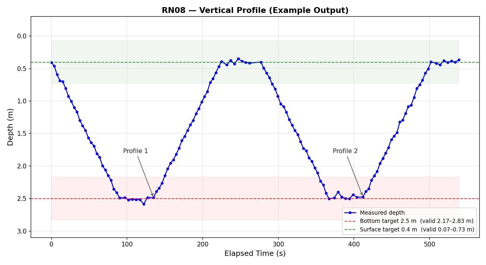

# RN08 Float
**Team RN08** — Autonomous vertical profiler for MATE ROV competition.

---

## MATE ROV Mission Requirements

The float must autonomously execute **two complete vertical profiles** after deployment.
Surfacing on its own is a **5-point penalty** — the float must wait to be recovered by the ROV.

### Each Profile

| Step | Target | Valid window | Requirement |
|------|--------|-------------|-------------|
| Descend | 2.5 m | 2.17 – 2.83 m (±33 cm) | Reach target before holding |
| Hold bottom | 2.5 m | 2.17 – 2.83 m | Log **7 packets** at **5-second intervals**; clock resets if depth drifts out |
| Ascend | 0.4 m | 0.07 – 0.73 m (±33 cm) | Must not break the surface |
| Hold surface | 0.4 m | 0.07 – 0.73 m | Log **7 packets** at **5-second intervals**; same clock-reset rule |

**Minimum packets required:** 7 per hold × 2 holds × 2 profiles = **28 packets total** (20 minimum per manual).

### Data Packet Format

One packet every 5 seconds throughout the dive:
```
RN08  HH:MM:SS  XXXX.X kPa  X.XX meters
```
Fields: team number · local time · pressure in kPa · depth in meters.

### Plot Requirements
- X axis: elapsed time (seconds)
- Y axis: depth (meters, **0 at top** — oceanographic convention)
- Must include **≥ 20 data points** across both profiles
- Must be **computer-generated** and saved as a JPG
- Should show two distinct "U" shapes

### Example Plot



---

## Network Architecture

```
[Shore laptop / ROV controller]          [Float — inside the float body]
  192.168.3.46  port 5001                  192.168.3.120  port 5000
  controller.py                            server.py + depthadjust.py

  Web UI at http://192.168.3.46:5001  ←→  REST API at http://192.168.3.120:5000
  /float/<endpoint>  ─────────────────────→  proxy forwards to float
  POST /receive  ←────────────────────────   transmitData() after mission
  POST /fetch    ─────────────────────────→  controller pulls on demand
```

Both machines must be on the same WiFi network (192.168.3.x).
During the dive the float is underwater with no WiFi — that is expected and fine.

---

## How Data Gets to the Controller

### During the dive
The float logs packets to `data.csv`. It cannot transmit — it is underwater.

### After profiles complete
The float immediately begins a **retry loop**:
1. Tries to POST `data.csv` to the controller every **10 seconds**
2. Each attempt has a **5-second timeout** so it fails fast underwater
3. `no link (ConnectionError) — still underwater?` is **normal** while submerged
4. When the ROV brings the float up, WiFi reconnects and the next retry succeeds
5. Switches to a **30-second heartbeat** after first success

**Duplicate transmissions are safe** — the controller overwrites the file each time and checks the MD5 hash to avoid re-processing unchanged data.

### Backup
Click **"Fetch CSV from float"** on the controller UI to pull the data directly.

---

## Configuring a Static IP on the Float

```bash
nmcli connection show          # find your WiFi connection name
sudo nmcli connection modify "YOUR-CONNECTION-NAME" \
  ipv4.method manual \
  ipv4.addresses "192.168.3.120/24" \
  ipv4.gateway "192.168.3.1" \
  ipv4.dns "192.168.3.1"
sudo nmcli connection up "YOUR-CONNECTION-NAME"
ip addr show wlan0             # verify: should show 192.168.3.120
```

To revert to DHCP: `sudo nmcli connection modify "NAME" ipv4.method auto`

The float's Home page shows its current IP and whether the controller is reachable.

---

## Pre-Deployment Checklist

```
□ 1.  git pull on float Pi       →  sudo systemctl restart float
□ 2.  git pull on controller Pi  →  sudo systemctl restart float-controller
□ 3.  Open http://192.168.3.46:5001 — confirm float shows "reachable"
□ 4.  Go to /tuning — click "🔬 Sim Run" — watch virtual depth change,
       syringe moves, plot appears on controller. Confirms full data flow.
□ 5.  Run test_extend.py on float — piston must extend (go out)
□ 6.  Calibrate bias: click "Calibrate bias" with float at surface in air
       Expect bias ≈ −0.09 to −0.12 m
□ 7.  Place float in water — should float with some freeboard
□ 8.  Click "Start Mission" (competition) or "🧪 Test Run" (surfaces after)
□ 9.  Float runs both profiles autonomously (~8–10 minutes)
□ 10. Float stops actuator, begins transmission retry (failures are normal)
□ 11. ROV retrieves float, brings to surface
□ 12. Within 10 seconds: controller log shows SUCCESS
□ 13. Open http://192.168.3.46:5001/comp — verify plot and data for judges
□ 14. Click "Download CSV" — save for judges
```

---

## Setup

### Float (192.168.3.120)

```bash
git clone git@github.com:slvusd/float.git
cd float
bash install.sh
```

```bash
sudo systemctl status float          # check
sudo systemctl restart float         # restart after git pull
sudo journalctl -u float -f          # live logs
```

### Controller (192.168.3.46)

```bash
git clone git@github.com:slvusd/float.git
cd float
bash install_controller.sh
```

```bash
sudo systemctl status float-controller
sudo systemctl restart float-controller
sudo journalctl -u float-controller -f
```

---

## Web Pages

All pages share a navigation bar at the top.

### Float (port 5000)

| Page | URL | Purpose |
|------|-----|---------|
| **Home** | `/` | Live depth/pressure, mission status, action buttons, current plot |
| **Tuning** | `/tuning` | Sliders for all parameters, sim/test/real run buttons |
| **Runs** | `/runs` | Archived run history — download CSV or plot any past run |
| **Log** | `/log` | Last 200 lines of `float.log` for diagnostics |

### Controller (port 5001)

| Page | URL | Purpose |
|------|-----|---------|
| **Home** | `/` | Float live status, proxied controls, mission timeline, plot, raw data |
| **Tuning** | `/tuning` | Per-run parameter control, sim/test run, live results |
| **Competition** | `/comp` | Clean results page for judges: plot + data table + CSV download |
| **Float Runs** | `/float/runs` | Float's archived run history (proxied) |
| **Float Log** | `/float/log` | Float's diagnostic log (proxied) |

---

## REST API — Float (port 5000)

### Pages
| `GET` | `/tuning` | Parameter tuning UI |
| `GET` | `/runs` | Run history page |
| `GET` | `/log` | Last 200 lines of float.log |

### Actuator
| Method | Endpoint | Description |
|--------|----------|-------------|
| `POST` | `/extend?duration=20` | Extend actuator N seconds |
| `POST` | `/retract?duration=20` | Retract actuator N seconds |
| `POST` | `/stop` | Stop actuator immediately |

### Sensor / Bias
| Method | Endpoint | Description |
|--------|----------|-------------|
| `GET` | `/depth` | Raw depth, bias-corrected depth, pressure in kPa |
| `GET` | `/bias` | Return current bias (meters) |
| `GET` | `/bias?value=-0.0983` | Set bias |
| `POST` | `/calibrate` | Auto-calibrate: 10 readings at surface |

### Mission
| Method | Endpoint | Description |
|--------|----------|-------------|
| `POST` | `/start` | Start mission (accepts tuning params as query args) |
| `GET` | `/status` | Mission running, bias, packets logged |
| `GET` | `/config` | Current tunable config values as JSON |
| `GET` | `/network` | Float's IP address and controller reachability |
| `GET` | `/data` | Download current `data.csv` |
| `GET` | `/plot` | Current run depth-vs-time JPG |
| `GET` | `/runs/<name>` | Download archived run CSV |
| `GET` | `/runs/<name>/plot` | Plot for any archived run |

#### `/start` query parameters
| Param | Example | Description |
|-------|---------|-------------|
| `test=true` | | Surface after profiles (no ROV needed) |
| `sim=true` | | Mock depth sensor, real actuator GPIO |
| `sim_rate=0.1` | | Sim descent speed in m/s (default 0.08) |
| `duty=75` | | Actuator PWM % |
| `deadband=0.05` | | Control deadband in meters |
| `target_bottom=2.5` | | Override bottom target depth |
| `target_surface=0.4` | | Override surface target depth |
| `sensor_offset=0.15` | | Physical sensor position offset |
| `surface_delay=60` | | Seconds before surfacing in test/sim mode |
| `surface_extend=30` | | Seconds to extend when surfacing |

---

## REST API — Controller (port 5001)

| Method | Endpoint | Description |
|--------|----------|-------------|
| `GET` | `/` | Controller home UI |
| `GET` | `/comp` | Competition results page (for judges) |
| `GET` | `/tuning` | Tuning UI |
| `GET/POST` | `/float/<path>` | Proxy — forwards to float |
| `POST` | `/receive` | Float pushes CSV here |
| `POST` | `/fetch` | Pull CSV from float |
| `GET` | `/data` | Download received CSV |
| `GET` | `/plot` | Generate JPG from received data |
| `GET` | `/events` | Mission timeline JSON |
| `GET` | `/rawdata` | Received packets as JSON array |

---

## Test Scripts

Run these before deploying. Stop the float service first if needed:
`sudo systemctl stop float`

| Script | Command | What it checks |
|--------|---------|----------------|
| `test_extend.py` | `python test_extend.py` | Piston goes **out** — if it retracts, swap pins in `config.py` |
| `test_actuator.py` | `python test_actuator.py [--duty 50] [--duration 8]` | Both directions with optional PWM |
| `test_depth.py` | `python test_depth.py [--bias -98.3]` | Continuous depth in mm; ≈ 0 mm in air with correct bias |

---

## Hardware

| Component | Detail |
|-----------|--------|
| Pi Zero 2 W | BCM pin mode |
| MS5837-02BA | Pressure/depth sensor (I2C bus 1) |
| H-bridge enable | GPIO 27 |
| H-bridge positive | GPIO 23 |
| H-bridge negative | GPIO 24 |

---

## Files

| File / Directory | Purpose |
|-----------------|---------|
| `server.py` | Float REST API + web UI (port 5000) |
| `controller.py` | Controller proxy + data receiver (port 5001) |
| `depthadjust.py` | Mission script — profiles, logging, transmission, sim mode |
| `depthdetect.py` | MS5837 sensor wrapper |
| `actuator.py` | H-bridge / actuator control with PWM |
| `config.py` | All pin assignments, mission params, network IPs/ports, tuning defaults |
| `ms5837/` | Vendored Blue Robotics MS5837 library |
| `float.service` | systemd template for float |
| `controller.service` | systemd template for controller |
| `install.sh` | Float setup: apt, venv, systemd |
| `install_controller.sh` | Controller setup: apt, venv, systemd |
| `TUNING.md` | Tuning guide for the team |
| `example_plot.jpg` | Example mission output plot |
| `bias.json` | Persisted depth bias (runtime) |
| `data.csv` | Current mission data (runtime) |
| `float.log` | Rotating diagnostic log (runtime) |
| `runs/` | Archived run CSVs — last 10 kept (runtime) |
| `received_data.csv` | Data received by controller (runtime) |
| `received_data.hash` | MD5 of last received data — prevents duplicate processing |
| `events.json` | Mission timeline (started, first data, last heartbeat) |
